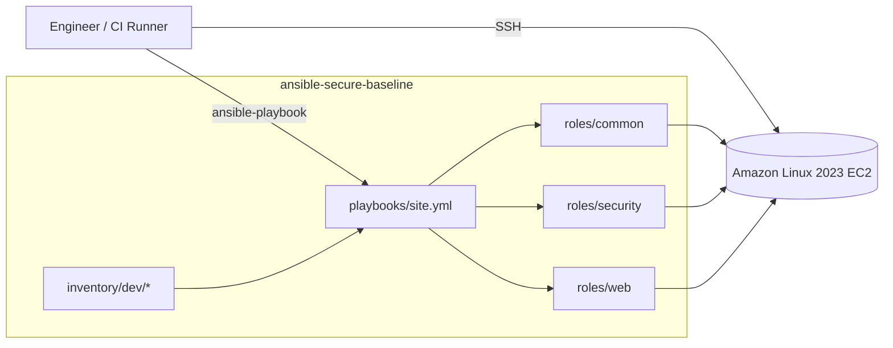
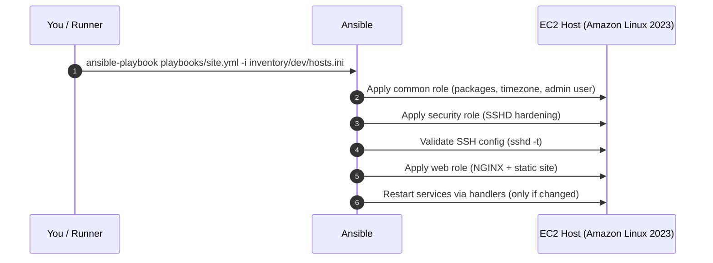

# ansible-secure-baseline (Amazon Linux 2023)

Portfolio-ready Ansible project that enforces a secure, repeatable OS baseline and deploys application services using role-based automation on Amazon Linux 2023.

---

## Why this exists

In real environments, infrastructure provisioning and OS configuration are separate concerns:

- Terraform / CloudFormation: creates VPC, subnets, EC2, security groups, IAM, etc.

- Ansible: configures the OS + services after the server exists

This repo demonstrates a production-style pattern: IaC owns lifecycle, Ansible owns configuration and drift prevention.

---



---


```markdown

## Execution Flow



## What this project does

The project applies a secure baseline using modular Ansible roles:

## Roles

- **common**
    - Baseline packages
    - Timezone configuration
    - Optional admin user bootstrap (if enabled)
- **security**
    - SSH hardening (safe defaults)
    - Safety validation before restart using sshd -t
- **web**
    - NGINX install + enable
    - Deploy static page/content
    - Uses handlers to restart only when changes occur

### Key characteristics

- Role-based Ansible design (idempotent automation)
- Secure configuration enforcement (SSHD hardening)
- Inventory with `group_vars` and `host_vars` for environment-specific config
- Service deployment using handlers (NGINX)
- Operational safety checks before applying changes

---

## Failure & Safety Considerations

To ensure safe operation in production environments:

- SSH configuration is validated using `sshd -t` before restart
- Services restart only when changes occur via handlers
- Tasks are idempotent to prevent configuration drift

---

## Repository Structure

```txt
inventory/dev/hosts.ini
inventory/dev/group_vars/all.yml
inventory/dev/host_vars/web1.yml
playbooks/site.yml
roles/common
roles/security
roles/web
diagram/architecture.drawio
```
---

## Prerequisites

- Ansible installed locally (or in your CI runner)
- SSH access to the instance (key-based auth)
- EC2 security group allows inbound SSH from your IP (or via bastion/SSM)

Recommended: start with a single dev host, then expand to multiple hosts/groups.
